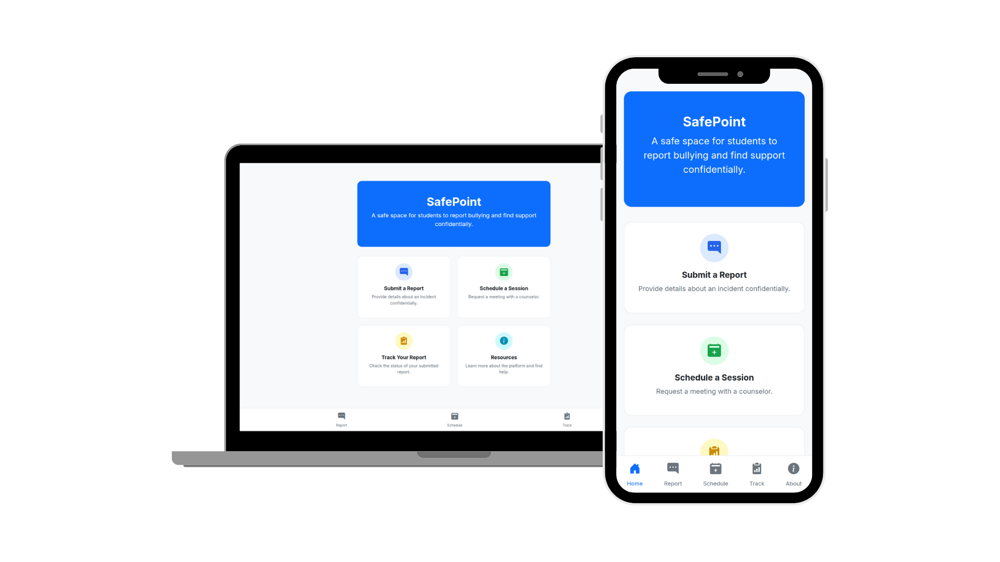

# SafePoint

<p align="center">
    
    
    
    
    
</p>



SafePoint is a simple, full-stack web application to provide a platform for students to report bullying incidents and schedule one-on-one counseling sessions.

## Getting Started

These instructions will get you a copy of the project up and running on your local machine for development and testing purposes.

### Prerequisites

- Java Development Kit (JDK) 17 or higher
- Apache Maven 3.6.0 or higher

**1. Clone the repository:**

```sh
git clone https://github.com/keiaa-75/safepoint.git
cd safepoint
```

**2. Build the project:**

```sh
mvn clean install
```

**3. Run the application:**

From your IDE, you can run the `SafePointApplication.java` file as a Spring Boot app. Alternatively, you can use the command line:

```sh
mvn spring-boot:run
```

The application will start on port `9090`.


## Development Properties

This project requires `app-secrets.properties` and `datasource.properties` for local development. These files contain sensitive configuration (such as email credentials and database settings) and are therefore excluded from version control. You may refer to the included template files.

The [EmailService](src/main/java/com/keiaa/safepoint/service/EmailService.java) uses mail-related properties to automatically communicate actions and updates to the user.

**You must create these files before running the app.**

## License

This repository is licensed under Mozilla Public License 2.0. Please refer to the [LICENSE](LICENSE) file for full details. Other resources included, such as images, are licensed under [Creative Commons Attribution Non-Commercial Share-Alike 4.0 International](https://creativecommons.org/licenses/by-nc-sa/4.0/).