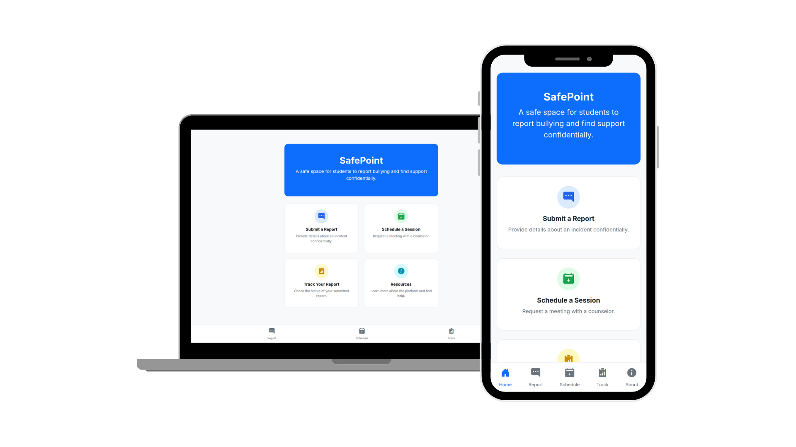

# SafePoint

<p align="center">
    
    
    
    
    
</p>



SafePoint is a simple, full-stack web application to provide a platform for students to report bullying incidents and get support confidentially.

## Getting Started

These instructions will get you a copy of the project up and running on your local machine for development and testing purposes.

### Prerequisites

- Java Development Kit (JDK) 17 or higher
- Apache Maven 3.6.0 or higher

**1. Clone the repository:**

```sh
git clone https://github.com/keiaa-75/safepoint.git
cd safepoint
```

**2. Build the project:**

```sh
mvn clean install
```

**3. Run the application:**

From your IDE, you can run the `SafePointApplication.java` file as a Spring Boot app. Alternatively, you can use the command line:

```sh
mvn spring-boot:run
```

The application will start on port `9090`.

## Development Properties
 
This project requires `app-secrets.properties` for local development. This file contains sensitive configuration (email credentials) and is therefore excluded from version control. You may refer to the included template file.
 
The [EmailService](src/main/java/com/keiaa/safepoint/service/EmailService.java) uses mail-related properties to automatically communicate actions and updates to the user.
 
**You must create this file before running the app.**
 
## Database Configuration
 
SafePoint runs against either of two databases, selected by Spring profile:
 
| Profile | Database | Config file | Use case |
|---|---|---|---|
| `dev` (default) | H2, file-based (`data/safepoint.mv.db`) | [`application-dev.properties`](src/main/resources/application-dev.properties) | Local development — no setup, data persists across restarts in the `data/` folder |
| `prod` | PostgreSQL | [`application-prod.properties`](src/main/resources/application-prod.properties) | Deployment — persistent, external database |
 
`spring.jpa.hibernate.ddl-auto=update` in the base [`application.properties`](src/main/resources/application.properties) applies to both: Hibernate generates the correct dialect-specific schema for whichever database is active, so the JPA entities themselves never need to change between the two.
 
Running locally (`mvn spring-boot:run` or from your IDE) uses the `dev` profile automatically — no database setup needed. The H2 database file lives under `data/` in the project root and is created automatically on first run; it's gitignored, so each contributor gets their own local copy, and deleting the folder resets your local data.
 
To run against PostgreSQL instead, provide a running Postgres instance and set:
 
```sh
export SPRING_PROFILES_ACTIVE=prod
export DB_URL=jdbc:postgresql://localhost:5432/safepoint
export DB_USERNAME=safepoint
export DB_PASSWORD=your-password
mvn spring-boot:run
```
 
In production, these same four variables are set as `Environment=` entries in the systemd unit rather than exported manually — `application-prod.properties` never contains real credentials itself, only the `${DB_URL}` / `${DB_USERNAME}` / `${DB_PASSWORD}` placeholders.

## License

This repository is licensed under Mozilla Public License 2.0. Please refer to the [LICENSE](LICENSE) file for full details. Other resources included, such as images, are licensed under [Creative Commons Attribution Non-Commercial Share-Alike 4.0 International](https://creativecommons.org/licenses/by-nc-sa/4.0/).
